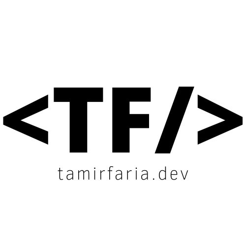

    

 
<h2 align="center">Boilerplate ReactJS with Vite</h2>
 

  
  

  
  

  
  

  
  

 

---
 
<<<<<<< HEAD
<i>
Boilerplate desenvolvido para facilitar a inicialização de outros projetos.
O repositório possui uma estrutura base configurada para iniciar projetos React com Typescript.
Qualquer coisa é só entrar em contato!
</i>

    
    
    <a href="https://twitter.com/tamirfaria" style="color: unset; text-decoration: none" target="_blank">
=======
<h3 style="color: white; backgroud-color: black">
Boilerplate desenvolvido para facilitar a inicialização de outros projetos.
O repositório possui uma estrutura base configurada para iniciar projetos React com Typescript.
Qualquer coisa é só entrar em contato!
</h3>

    
    
    <a href="https://twitter.com/tamirfaria" style="color: unset; text-decoration: none" target="blank">
>>>>>>> 33a6f80c2b223e99411589d9efb9fa48b18accd3
      
    </a>

